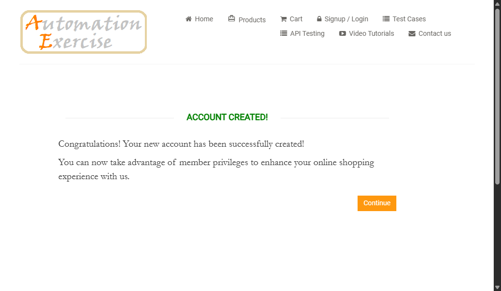
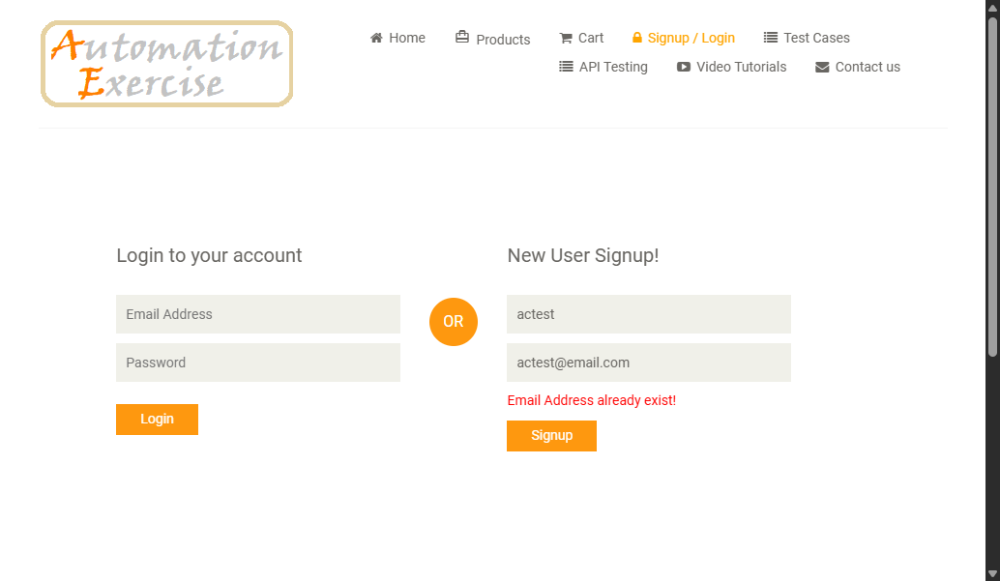
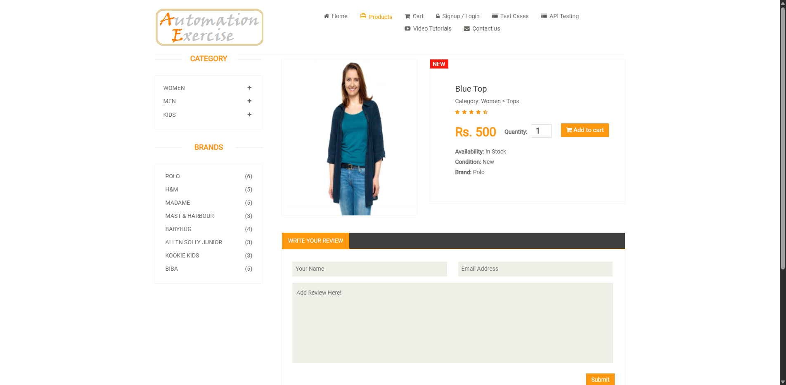
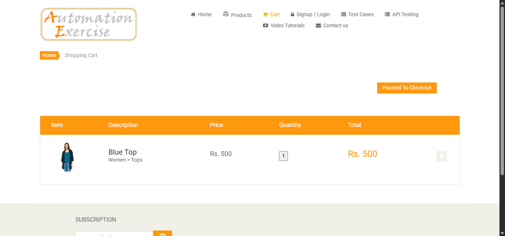
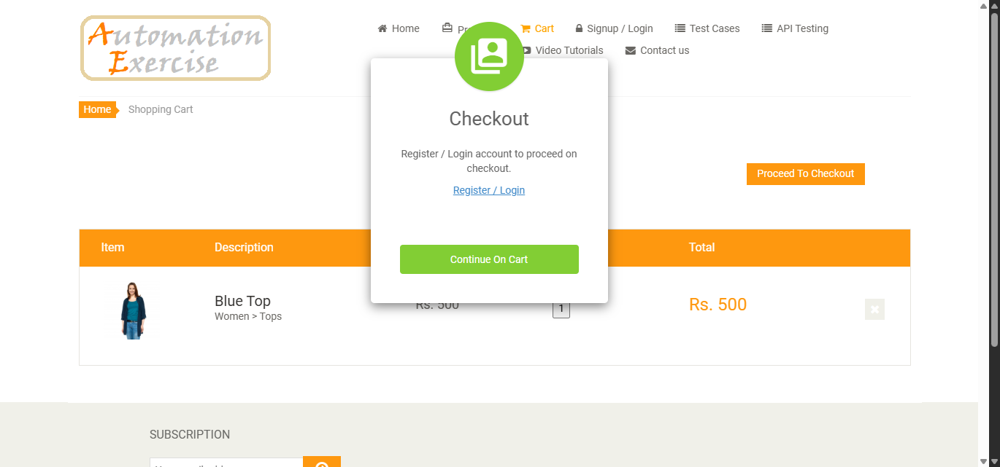
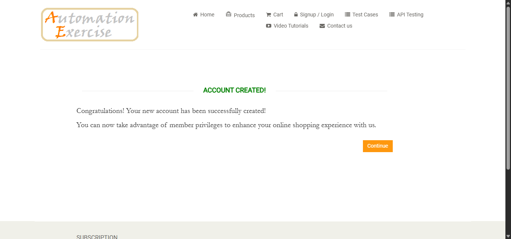
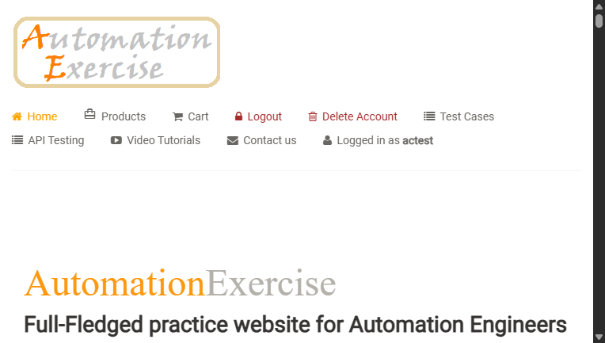
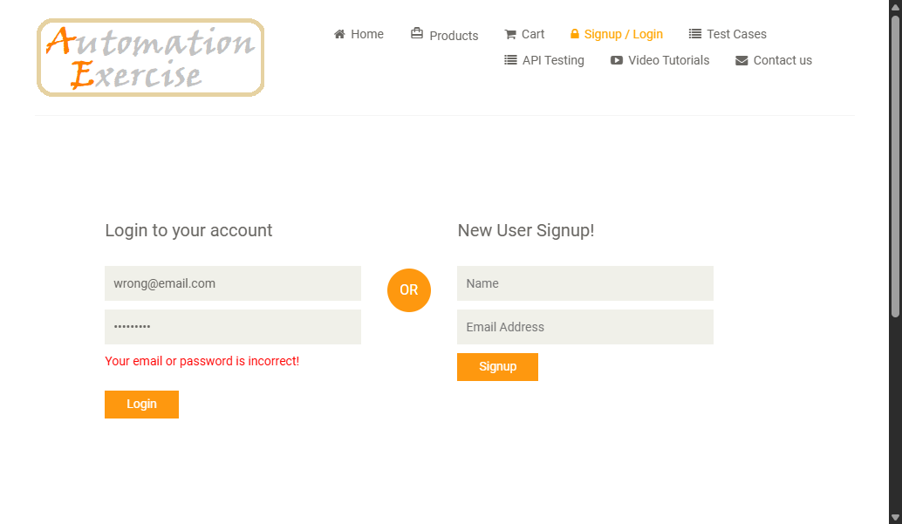

# 🧪 Automation Testing – AutomationExercise Website

Repository ini berisi **automation testing menggunakan Selenium (Python)** untuk website:

🔗 **http://automationexercise.com**

Project ini dibuat sebagai bagian dari **tugas/praktikum mata kuliah Pengujian Perangkat Lunak**, dengan fokus pada:

- End-to-End Testing
- Positive & Negative Test Case
- Screenshot sebagai bukti pengujian

---

## 🛠️ Tech Stack

- **Python 3**
- **Selenium WebDriver**
- **unittest**
- **Google Chrome**
- **VS Code**

---

## 📂 Project Structure

automationexercise/
│
├── checkout_register_test.py
├── login_positive_test.py
├── login_negative_test.py
├── product_test.py
├── register_positive_test.py
├── register_negative_test.py
│
├── screenshots/
│ ├── 02_add_to_cart_popup.png
│ ├── 03_cart.png
│ ├── 04_checkout_popup.png
│ ├── 08_after_create_account.png
│ ├── login_positive.png
│ ├── login_negative.png
│ ├── TC03_all_products.png
│ ├── TC03_product_detail.png
│ ├── test_register_user_end_to_end.png
│ └── test_register_with_existing_email.png
│
└── README.md

---

## ✅ Test Cases Implemented

### 🔹 TC01 – Register User (End-to-End)

**Steps:**

1. Navigate to homepage
2. Click Signup / Login
3. Register new user
4. Fill account information
5. Verify **ACCOUNT CREATED**
6. Verify logged-in user

**Result:** ✅ PASS

**Evidence:**


---

### 🔹 TC02 – Register User with Existing Email (Negative Test)

**Steps:**

1. Navigate to Signup page
2. Register using existing email
3. Verify error message

**Expected Result:**  
`Email Address already exist!`

**Result:** ✅ PASS

**Evidence:**


---

### 🔹 TC03 – Verify All Products & Product Detail Page

**Steps:**

1. Navigate to Products page
2. Verify product list is visible
3. Click View Product
4. Verify product details:
   - Name
   - Category
   - Price
   - Availability
   - Condition
   - Brand

**Result:** ✅ PASS

**Evidence:**




---

### 🔹 TC04 – Place Order: Register While Checkout

**Steps:**

1. Add product to cart
2. Proceed to checkout
3. Register new user during checkout
4. Fill mandatory account details
5. Verify **ACCOUNT CREATED**
6. Continue checkout

**Result:** ⚠️ PASS / System Limitation (Website Demo)

**Evidence:**








---

### 🔹 TC05 – Login User with Correct Email & Password

**Steps:**

1. Navigate to Login page
2. Input valid email and password
3. Click Login
4. Verify user logged in

**Result:** ✅ PASS

**Evidence:**


---

### 🔹 TC06 – Login User with Incorrect Email & Password (Negative Test)

**Steps:**

1. Navigate to Login page
2. Input invalid email or password
3. Click Login
4. Verify error message

**Expected Result:**  
`Your email or password is incorrect!`

**Result:** ✅ PASS

**Evidence:**


---

## ⚠️ Notes & Observations

- Website **AutomationExercise** adalah **demo testing site**
- Beberapa fitur (khususnya _Register while Checkout_) **tidak selalu stabil**
- Script automation menggunakan:
  - Explicit Wait
  - JavaScript Click
  - Scroll Handling
  - Screenshot untuk bukti pengujian
- Jika test gagal, dikategorikan sebagai **System Limitation**, bukan kesalahan script

---

## ▶️ How to Run

1. Install dependency:
   ```bash
   pip install selenium
   ```

---

## ✅ Test Cases Implemented

### 🔹 TC01 – Register User (End-to-End)

**Steps:**

1. Navigate to homepage
2. Click Signup / Login
3. Register new user
4. Fill account information
5. Verify **ACCOUNT CREATED**
6. Verify logged-in user

**Result:** ✅ PASS

**Evidence:**


---

### 🔹 TC02 – Register User with Existing Email (Negative Test)

**Steps:**

1. Navigate to Signup page
2. Register using existing email
3. Verify error message

**Expected Result:**  
`Email Address already exist!`

**Result:** ✅ PASS

**Evidence:**


---

### 🔹 TC03 – Verify All Products & Product Detail Page

**Steps:**

1. Navigate to Products page
2. Verify product list is visible
3. Click View Product
4. Verify product details:
   - Name
   - Category
   - Price
   - Availability
   - Condition
   - Brand

**Result:** ✅ PASS

**Evidence:**


---

### 🔹 TC04 – Place Order: Register While Checkout

**Steps:**

1. Add product to cart
2. Proceed to checkout
3. Register new user during checkout
4. Fill mandatory account details
5. Verify **ACCOUNT CREATED**
6. Continue checkout

**Result:** ⚠️ PASS / System Limitation (Website Demo)

**Evidence:**


---

### 🔹 TC05 – Login User with Correct Email & Password

**Steps:**

1. Navigate to Login page
2. Input valid email and password
3. Click Login
4. Verify user logged in

**Result:** ✅ PASS

**Evidence:**


---

### 🔹 TC06 – Login User with Incorrect Email & Password (Negative Test)

**Steps:**

1. Navigate to Login page
2. Input invalid email or password
3. Click Login
4. Verify error message

**Expected Result:**  
`Your email or password is incorrect!`

**Result:** ✅ PASS

**Evidence:**


---

## ⚠️ Notes & Observations

- Website **AutomationExercise** adalah **demo testing site**
- Beberapa fitur (khususnya _Register while Checkout_) **tidak selalu stabil**
- Script automation menggunakan:
  - Explicit Wait
  - JavaScript Click
  - Scroll Handling
  - Screenshot untuk bukti pengujian
- Jika test gagal, dikategorikan sebagai **System Limitation**, bukan kesalahan script

---

## ▶️ How to Run

1. Install dependency:
   ```bash
   pip install selenium
   ```
2. Pastikan ChromeDriver sesuai dengan versi Chrome

3. Jalankan test:
   python checkout_register_test.py
